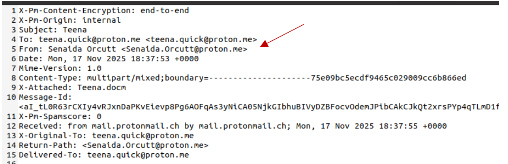
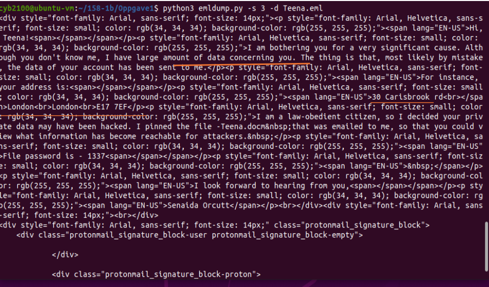
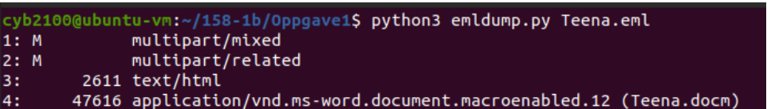
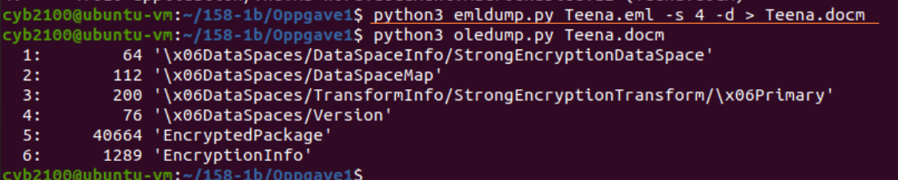
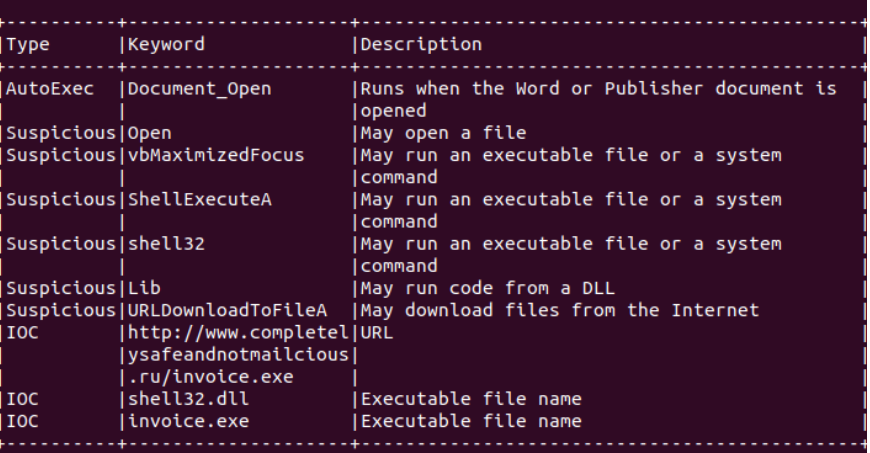
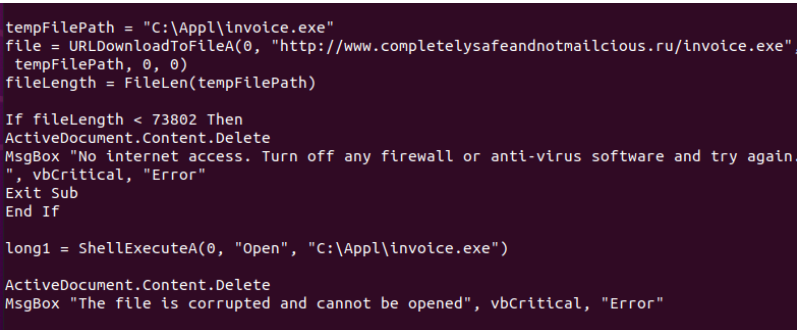
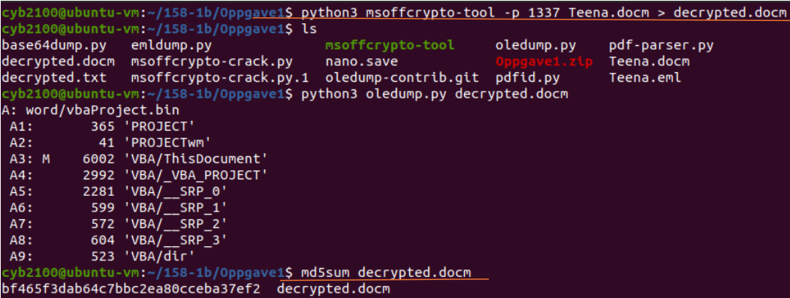
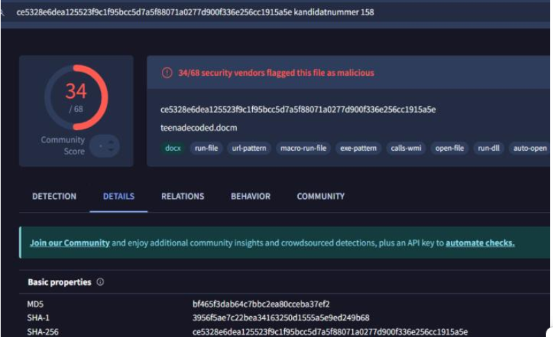
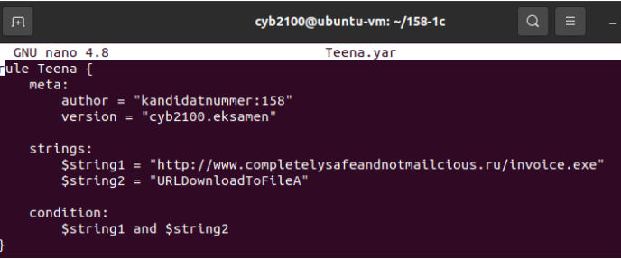
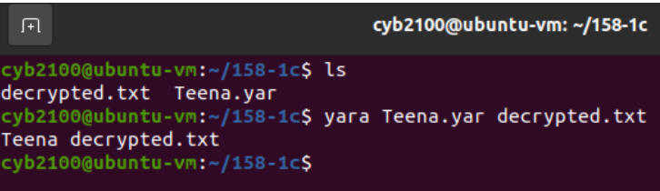

# Phishing Maldoc Analysis

## Summary
I analysed a spearphishing email containing a password protected Word document ('Teena.docm') for my cyber defence course.
The document contains a macro that downloads and runs 'invoice.exe' when opened. 34 security vendors on VirusTotal flagged the file as malicious.

## The email
As seen in the content, the attacker attempts to appear credible by including the recipient's address (likely obtained via OSINT) and using manipulation techniques such as “I am a law obedient citizen." This aims to convince the user that the sender simply wants to ensure the recipient can view content concerning themselves. This tactic plays on curiosity and fear, prompting the victim to view the content. A password is provided to open the document, and a "Proton" signature is included to further enhance the appearance of credibility.

The attacker used the free service ProtonMail (the same service used by the recipient) to make it appear as though the email originated from the same domain. OSINT was likely used to identify which email services do not trigger security flags. ProtonMail encrypts messages for security, giving the email the appearance of being secure 

## Analysis
### Step 1: Extract the attachment
To determine what the code does and how it executes, I used emldump.py and oledump.py by Didier Stevens, and olevba from oletools by Phillipe Lagadec to analyse the code. It became quite clear that there is an attachment named Teena.docm containing macros and the malicious code. I first extracted the attachment to a separate file so I could analyze it with oledump. I then used oletools to view the file’s contents without executing the code in a controlled environment on a virtual machine.

### Step 2: Analyse the macro
Here, we see that the code runs automatically when the user opens the document.
It is "Document_Open()" that executes the code.

The macro uses URLDownloadToFileA to downloads invoice.exe from a website and saves it as C:\APPl\invoice.exe. It then runs the file with ShellExectueA.
It also displays error messages, and the macro deletes the document’s content and shows a fake error message (“The file is corrupted and cannot be opened”), so the user thinks the file is broken.

### Step 3: Check the hash on VirusTotal
Here, I am decrypting the same file using the msoffcrypto-tool. I calculated the MD5 hash to
confirm whether this code is flagged by other vendors on VirusTotal.
VirusTotal confirmed the suspicion, with 34 of 64 vendors flagging it. Here, you can look at the "BEHAVIOR" and "files dropped" sections to see which files are dropped and what changes they make. 

## MITRE ATT&CK Mapping
- T1566.001 Spearphishing Attachment: Teena.docm was attached to the email
- T1585.002 Establish Accounts: Email Accounts: the attacker used ProtonMail
- T1027 Obfuscated Files or Information: the document was password protected
- T1036 Masquerading: The file looked like a normal Word document
- T1204.002 User Execution: Malicious File: The user had to open the file
- 
## Detection: YARA Rule
I have chosen to create a YARA signature for the URL string and the "URLDownloadToFileA" function, because these must be present for the code to work. The URL and the function used to download the file will most likely remain the same.

## Tools Used
emldump, oledump, olevba, msoffcrypto-tool, VirusTotal, Yara
